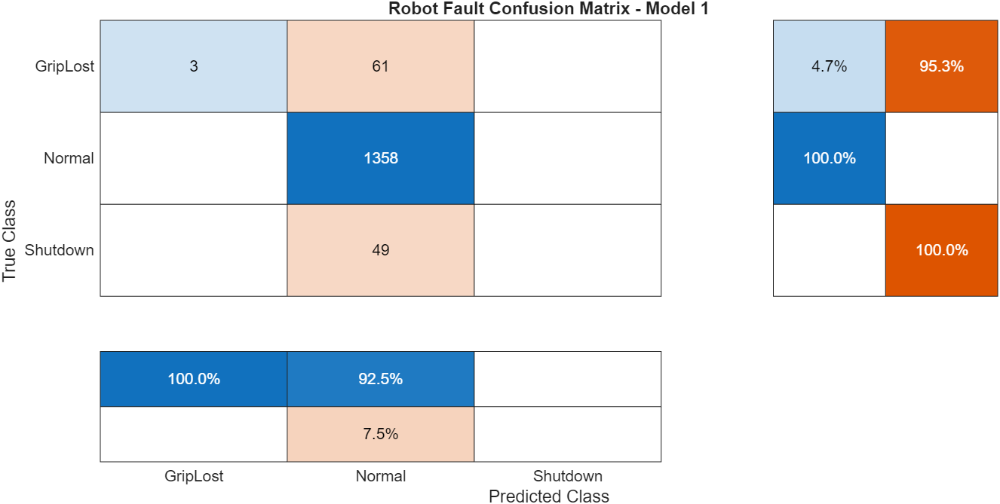
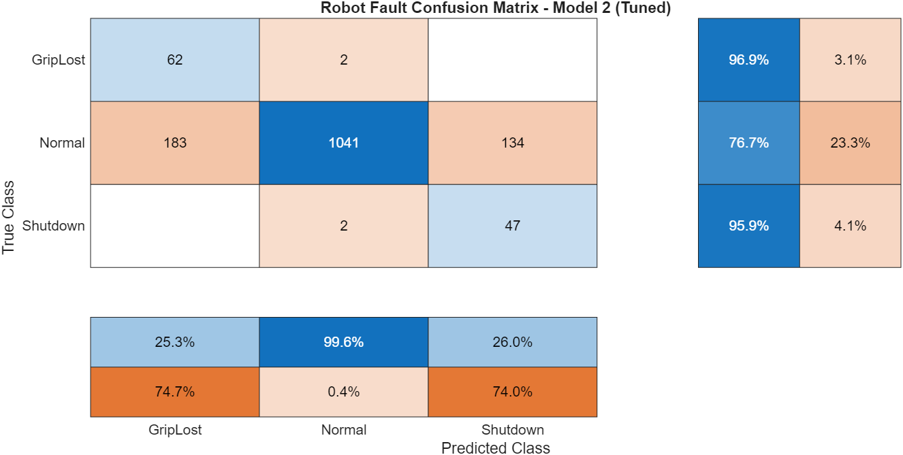
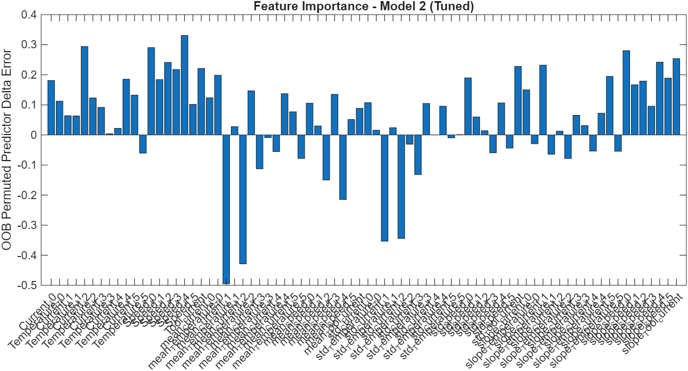

# Robot Fault Prediction - MCEN 3030 ML Project
**Author:** Nick Parkes  
**Course:** MCEN 3030  

---

## Problem Description

This project uses machine learning to predict robot faults from sensor data. A robotic system records electrical current, temperature, and speed across six joints over time. The target variable is a fault condition — either a **protective shutdown** or a **loss of grip**. The goal is to train a classifier that can predict these faults from the sensor history, which could allow for early intervention before a fault occurs.

The dataset contains 7,409 time-series readings with 19 sensor features and approximately 54 missing values scattered across sensor columns.

---

 — Initial Prompt

The following prompt was used to begin the LLM-assisted design process:

> *"I have a dataset from a robotic system with time series data including electrical current, temperature, and speed. The target is a fault condition — either a shutdown or loss of grip. There are some missing values. What ML approach do you recommend and why?"*

---

 ##— Method: Random Forest

The LLM recommended a **Random Forest classifier**.

### What is a Decision Tree?
A decision tree works like a flowchart. At each node, it asks a yes/no question about a feature — for example, "Is Current_J2 > 4.2 amps?" — and splits the data accordingly. It keeps splitting until it reaches a final prediction. A single tree is powerful but tends to **overfit**, meaning it memorizes the training data and performs poorly on new data.

### What is a Random Forest?
A random forest fixes overfitting by building hundreds of trees, each trained on a **random bootstrap sample** of the data and using only a **random subset of features** at each split. This forces diversity among the trees — they each learn slightly different patterns. When predicting, every tree votes and the majority wins. Because the errors of individual trees are random and uncorrelated, they cancel out in the vote, leaving only the true signal. This is called **ensemble learning**.

### Why Random Forest for This Problem?
- **Mixed features** — current, temperature, and speed interact in complex ways that random forest handles naturally
- **Missing values** — easily handled by removing affected rows before training
- **Classification task** — the target is categorical (Normal / Shutdown / GripLost), which is exactly what random forest classifiers are designed for
- **Feature importance** — after training, the model identifies which sensors matter most for predicting faults
- **Time series friendliness** — by building trend features (rolling averages, slopes), the sensor history can be captured as input features

### Trend Features
Raw sensor readings capture a snapshot in time, but faults build up over time. Trend features capture this history:
- **Rolling mean** — average of the last N readings (smooths noise)
- **Rolling standard deviation** — how much is the signal fluctuating?
- **Slope** — is the signal rising or falling?

### Validation Scheme
The data is randomly divided 80% for training and 20% for validation. The model is trained on the training set and evaluated on the validation set using a **confusion matrix** — a grid showing where the model makes correct and incorrect predictions across all three classes.

---

##— Model 1: Baseline

### Code
See `/code_1/Code_1ML_Project.m`

### Hyperparameters
| Parameter | Value |
|---|---|
| Number of trees | 100 |
| Max splits | 10 |
| Min leaf size | 5 |
| Features per split | 4 |
| Window size | 5 |

### Confusion Matrix

### Results & Discussion
The baseline model achieved high accuracy on the **Normal** class (100%) but almost completely failed on the fault classes:
- **GripLost:** only 4.7% correctly detected — 95.3% were missed
- **Shutdown:** 0% detected — every shutdown was predicted as Normal

This is a classic **class imbalance problem**. The dataset has approximately 1,358 normal readings but far fewer fault events. The model learns that predicting "Normal" is almost always correct, so it ignores the rare fault cases entirely. This is unacceptable for a safety-critical application — missing a shutdown or grip loss event could cause equipment damage or injury.

---

— Model 2: Tuned

### Prompts & LLM Discussion
After reviewing the Model 1 confusion matrix, the following was discussed with the LLM:

> *"The model is predicting Normal for almost everything and missing nearly all faults. How do I fix class imbalance in a MATLAB random forest?"*

The LLM recommended using a **cost matrix** to penalize missed faults heavily, increasing the window size for trend features to better capture fault buildup, and tuning hyperparameters to allow deeper trees that can learn from rare fault events.

### Changes Made
| Parameter | Model 1 | Model 2 | Reason |
|---|---|---|---|
| Window size | 5 | 15 | Captures longer fault buildup trends |
| Number of trees | 100 | 200 | More stable predictions |
| Max splits | 10 | 50 | Deeper trees catch rare fault patterns |
| Min leaf size | 5 | 1 | Allows learning from rare fault cases |
| Features per split | 4 | 8 | More features considered at each split |
| Cost matrix | none | 50x fault penalty | Forces model to prioritize fault detection |

The cost matrix assigns a penalty of 50 for predicting Normal when a fault actually occurred, versus a penalty of 1 for the reverse. This directly addresses the class imbalance by making the model treat missed faults as far more costly than false alarms.

### Code
See `/code_2/Code_2ML_Project.m`

### Confusion Matrix

### Results & Discussion
Model 2 showed dramatic improvement in fault detection:

| Metric | Model 1 | Model 2 |
|---|---|---|
| GripLost detected | 4.7% | **96.9%** |
| Shutdown detected | 0% | **95.9%** |
| Normal accuracy | 100% | 76.7% |

Normal accuracy dropped from 100% to 76.7%, meaning some normal readings are now flagged as faults. However, for a robot safety system this is the correct tradeoff — a false alarm is far less dangerous than a missed shutdown or grip loss event. The cost matrix worked exactly as intended.

---

##— Feature Importance

### Feature Importance Plot

### Discussion

**Most important positive features:**
- **Temperature_J2 and Current_J2** — Joint 2 is the dominant predictor across both models. This suggests Joint 2 experiences the most distinctive sensor behavior in the lead-up to fault events
- **Rolling means of current and temperature** across multiple joints — trend history over time is more predictive than raw instantaneous readings, confirming the value of the trend feature engineering
- **Slope features for speed** at several joints — the rate of change in speed is a strong fault indicator, suggesting faults are preceded by abnormal acceleration or deceleration patterns

**Negative importance features:**
Several `std_` and `mean_` features for certain joints have strongly negative importance values (as low as -0.5). This means these features are adding noise and actively confusing the classifier. A logical next step would be to remove these features and retrain, which could further improve Model 2's performance while reducing computation time.

**Key engineering insight:** The rolling mean of Joint 2's temperature and current are the strongest early warning signals for robot faults. In a real-world monitoring system, sensor alerts and predictive maintenance could be focused specifically around Joint 2 to detect fault conditions before they occur.

---

## Summary

This project successfully demonstrated that a tuned random forest classifier can predict robot faults with high accuracy when class imbalance is addressed through cost-sensitive learning. The most significant improvement between Model 1 and Model 2 came from the introduction of the cost matrix, which forced the model to prioritize fault detection over overall accuracy. Feature importance analysis revealed that Joint 2 temperature and current trends are the most valuable predictors, providing actionable insight for real-world robot monitoring.
